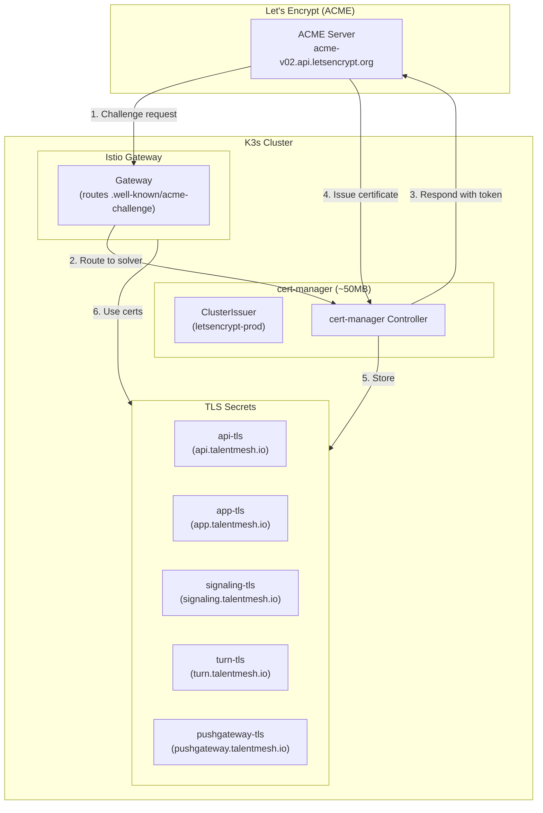

# ADR-017: cert-manager with HTTP-01 Challenge for TLS Certificates

## Status
**Accepted**

## Date
2026-01-07

## Context

Talent Mesh requires TLS certificates for secure HTTPS communication. Options considered:

1. **Manual certificates**: Generate and manage certificates manually
2. **Wildcard certificate (DNS-01)**: Single `*.talentmesh.io` certificate
3. **Individual certificates (HTTP-01)**: Per-service certificates with HTTP validation
4. **Individual certificates (DNS-01)**: Per-service certificates with DNS validation

Key constraints:
- **Security preference**: Individual certificates over wildcards (isolated failure domains)
- **Self-hosted CoreDNS**: We run authoritative DNS, but prefer simpler validation
- **Limited services**: Only 4-5 subdomains for MVP
- **Automation required**: Manual renewal not acceptable
- **Let's Encrypt**: Free, trusted certificates

## Decision

We will use **cert-manager** with **HTTP-01 ACME challenge** for individual TLS certificates.

### Why HTTP-01 Over DNS-01

| Factor | HTTP-01 | DNS-01 |
|--------|---------|--------|
| Setup complexity | **Simple** | Requires RFC 2136 + TSIG |
| CoreDNS changes | **None** | Needs `update` plugin |
| Wildcard support | No | Yes |
| Security | **Individual certs** | Often used for wildcards |
| Debugging | **Easy** (HTTP traffic) | Complex (DNS propagation) |

Since we prefer individual certificates for security, HTTP-01 is the simpler choice.

### Why Individual Certificates Over Wildcards

| Factor | Individual | Wildcard |
|--------|------------|----------|
| Security isolation | **Excellent** - one compromised cert doesn't affect others | Poor - all services affected |
| Revocation | **Granular** - revoke single service | All-or-nothing |
| Blast radius | **Limited** | Entire domain |
| Certificate count | ~4 for MVP | 1 |
| Let's Encrypt limits | 50/week (plenty) | N/A |
| Management | **Automated** via cert-manager | Also automated |

### Architecture



### Certificate Inventory (MVP)

| Subdomain | Service | Certificate Secret |
|-----------|---------|-------------------|
| `api.talentmesh.io` | Istio Gateway (REST APIs) | `api-tls` |
| `app.talentmesh.io` | Frontend (Next.js) | `app-tls` |
| `signaling.talentmesh.io` | WebRTC Signaling (WSS) | `signaling-tls` |
| `turn.talentmesh.io` | STUNner TURN Server | `turn-tls` |
| `pushgateway.talentmesh.io` | Prometheus Pushgateway (security metrics) | `pushgateway-tls` |

### Implementation

#### 1. Install cert-manager

```bash
# Add Helm repository
helm repo add jetstack https://charts.jetstack.io
helm repo update

# Install cert-manager with CRDs
helm install cert-manager jetstack/cert-manager \
  --namespace cert-manager \
  --create-namespace \
  --set installCRDs=true \
  --set resources.requests.memory=64Mi \
  --set resources.limits.memory=128Mi
```

#### 2. Create ClusterIssuer

```yaml
# k8s/infrastructure/cert-manager/cluster-issuer.yaml
apiVersion: cert-manager.io/v1
kind: ClusterIssuer
metadata:
  name: letsencrypt-prod
spec:
  acme:
    # Production ACME server
    server: https://acme-v02.api.letsencrypt.org/directory
    email: admin@talentmesh.io
    privateKeySecretRef:
      name: letsencrypt-prod-account-key
    solvers:
    - http01:
        ingress:
          class: istio
---
# Staging issuer for testing (higher rate limits)
apiVersion: cert-manager.io/v1
kind: ClusterIssuer
metadata:
  name: letsencrypt-staging
spec:
  acme:
    server: https://acme-staging-v02.api.letsencrypt.org/directory
    email: admin@talentmesh.io
    privateKeySecretRef:
      name: letsencrypt-staging-account-key
    solvers:
    - http01:
        ingress:
          class: istio
```

#### 3. Certificate Resources

```yaml
# k8s/infrastructure/cert-manager/certificates.yaml
apiVersion: cert-manager.io/v1
kind: Certificate
metadata:
  name: api-tls
  namespace: istio-system
spec:
  secretName: api-tls
  issuerRef:
    name: letsencrypt-prod
    kind: ClusterIssuer
  dnsNames:
  - api.talentmesh.io
---
apiVersion: cert-manager.io/v1
kind: Certificate
metadata:
  name: app-tls
  namespace: istio-system
spec:
  secretName: app-tls
  issuerRef:
    name: letsencrypt-prod
    kind: ClusterIssuer
  dnsNames:
  - app.talentmesh.io
---
apiVersion: cert-manager.io/v1
kind: Certificate
metadata:
  name: signaling-tls
  namespace: istio-system
spec:
  secretName: signaling-tls
  issuerRef:
    name: letsencrypt-prod
    kind: ClusterIssuer
  dnsNames:
  - signaling.talentmesh.io
---
apiVersion: cert-manager.io/v1
kind: Certificate
metadata:
  name: turn-tls
  namespace: istio-system
spec:
  secretName: turn-tls
  issuerRef:
    name: letsencrypt-prod
    kind: ClusterIssuer
  dnsNames:
  - turn.talentmesh.io
---
apiVersion: cert-manager.io/v1
kind: Certificate
metadata:
  name: pushgateway-tls
  namespace: istio-system
spec:
  secretName: pushgateway-tls
  issuerRef:
    name: letsencrypt-prod
    kind: ClusterIssuer
  dnsNames:
  - pushgateway.talentmesh.io
```

#### 4. Istio Gateway Configuration

```yaml
# k8s/infrastructure/istio/gateway.yaml
apiVersion: networking.istio.io/v1beta1
kind: Gateway
metadata:
  name: main-gateway
  namespace: istio-system
spec:
  selector:
    istio: gateway
  servers:
  # API Gateway
  - port:
      number: 443
      name: https-api
      protocol: HTTPS
    hosts:
    - api.talentmesh.io
    tls:
      mode: SIMPLE
      credentialName: api-tls
  # Frontend
  - port:
      number: 443
      name: https-app
      protocol: HTTPS
    hosts:
    - app.talentmesh.io
    tls:
      mode: SIMPLE
      credentialName: app-tls
  # WebRTC Signaling (WSS)
  - port:
      number: 443
      name: https-signaling
      protocol: HTTPS
    hosts:
    - signaling.talentmesh.io
    tls:
      mode: SIMPLE
      credentialName: signaling-tls
  # HTTP for ACME challenges (auto-redirect to HTTPS otherwise)
  - port:
      number: 80
      name: http
      protocol: HTTP
    hosts:
    - "*.talentmesh.io"
    tls:
      httpsRedirect: true
```

### Flux Integration

```yaml
# k8s/infrastructure/cert-manager/kustomization.yaml
apiVersion: kustomize.toolkit.fluxcd.io/v1
kind: Kustomization
metadata:
  name: cert-manager
  namespace: flux-system
spec:
  interval: 10m
  path: ./k8s/infrastructure/cert-manager
  prune: true
  sourceRef:
    kind: GitRepository
    name: flux-system
  healthChecks:
  - apiVersion: apps/v1
    kind: Deployment
    name: cert-manager
    namespace: cert-manager
```

## Consequences

### Positive

1. **Automated TLS**: No manual certificate management
2. **Free certificates**: Let's Encrypt at $0 cost
3. **Security isolation**: Individual certs limit blast radius
4. **Simple setup**: No DNS API configuration needed
5. **Debugging**: HTTP challenges easy to troubleshoot
6. **Istio integration**: Native support via ingress class

### Negative

1. **No wildcards**: Must create certificate for each subdomain
2. **HTTP exposure**: Port 80 must be open for challenges
3. **Rate limits**: 50 certs/week/domain (not an issue for MVP)

### Mitigations

- Use staging issuer for testing (higher rate limits)
- Kustomize overlays for consistent certificate definitions
- Monitor certificate expiry with Prometheus alerts

## Resource Budget

| Component | Memory | CPU |
|-----------|--------|-----|
| cert-manager controller | 64MB | 10m |
| cert-manager webhook | 32MB | 5m |
| cert-manager cainjector | 32MB | 5m |
| **Total** | **~128MB** | **~20m** |

## Renewal

cert-manager automatically renews certificates 30 days before expiry. Let's Encrypt certificates are valid for 90 days.

## Useful Commands

```bash
# Check certificate status
kubectl get certificates -A

# Check certificate details
kubectl describe certificate api-tls -n istio-system

# Check certificate secret
kubectl get secret api-tls -n istio-system -o yaml

# View cert-manager logs
kubectl logs -n cert-manager -l app=cert-manager

# Manually trigger renewal (for testing)
kubectl delete secret api-tls -n istio-system
# cert-manager will automatically recreate it

# Check ACME challenges
kubectl get challenges -A
```

## References

- [cert-manager Documentation](https://cert-manager.io/docs/)
- [Let's Encrypt ACME](https://letsencrypt.org/docs/)
- [HTTP-01 Challenge](https://cert-manager.io/docs/configuration/acme/http01/)
- [ADR-016: Flux GitOps](./ADR-016-FLUX-GITOPS.md)
- [ADR-008: Istio Only](./ADR-008-REMOVE-KONG-USE-ISTIO.md)

---

*ADR Version: 1.0*
*Last Updated: 2026-01-07*
