# ADR: TLS Certificates with cert-manager

**Status:** Accepted
**Date:** 2024-03-01
**Updated:** 2026-01-16

## Context

Need automated TLS certificate management for all services across multi-region deployments.

## Decision

Use **cert-manager** with Let's Encrypt HTTP-01 challenge (DNS-01 optional for wildcards).

## Architecture

```mermaid
flowchart TB
    subgraph K8s["Kubernetes Cluster"]
        CM[cert-manager]
        Issuer[ClusterIssuer]
        Certs[Certificates]
        Secrets[TLS Secrets]
    end

    subgraph External["External"]
        LE[Let's Encrypt]
        DNS[DNS Provider]
    end

    CM --> Issuer
    Issuer -->|"HTTP-01"| LE
    Issuer -->|"DNS-01 (optional)"| DNS
    DNS --> LE
    LE -->|"Issue cert"| CM
    CM --> Certs
    Certs --> Secrets
```



## Rationale

| Option | Automation | Cost | Wildcard |
|--------|------------|------|----------|
| Manual certs | No | $$$ | Yes |
| **cert-manager + LE** | Yes | $0 | Optional | **Selected** |
| Commercial CA | No | $$$ | Yes |

### Challenge Types

| Challenge | Wildcards | DNS Provider | Complexity |
|-----------|-----------|--------------|------------|
| HTTP-01 | No | None needed | Low |
| DNS-01 | Yes | Required | High |

**Key Decision Factors:**
- Zero cost (Let's Encrypt)
- Automatic renewal
- HTTP-01 for simplicity (default)
- DNS-01 available if wildcards needed

## Configuration

### ClusterIssuer (HTTP-01)

```yaml
apiVersion: cert-manager.io/v1
kind: ClusterIssuer
metadata:
  name: letsencrypt-prod
spec:
  acme:
    server: https://acme-v02.api.letsencrypt.org/directory
    email: admin@<domain>
    privateKeySecretRef:
      name: letsencrypt-prod-key
    solvers:
      - http01:
          ingress:
            class: cilium
```

### ClusterIssuer (DNS-01 - Optional)

```yaml
apiVersion: cert-manager.io/v1
kind: ClusterIssuer
metadata:
  name: letsencrypt-dns
spec:
  acme:
    server: https://acme-v02.api.letsencrypt.org/directory
    email: admin@<domain>
    privateKeySecretRef:
      name: letsencrypt-dns-key
    solvers:
      - dns01:
          cloudflare:
            apiTokenSecretRef:
              name: cloudflare-api-token
              key: api-token
```

### Certificate Template

```yaml
apiVersion: cert-manager.io/v1
kind: Certificate
metadata:
  name: <tenant>-tls
  namespace: <tenant>-prod
spec:
  secretName: <tenant>-tls
  issuerRef:
    name: letsencrypt-prod
    kind: ClusterIssuer
  dnsNames:
    - api.<tenant>.io
    - app.<tenant>.io
```

## Renewal Policy

| Setting | Value |
|---------|-------|
| Validity | 90 days |
| Renewal | 30 days before expiry |
| Retry | Automatic |

## Multi-Region Considerations


Each region manages its own certificates independently:
- Same ClusterIssuer configuration
- Independent certificate issuance
- No cross-region certificate sync needed

## Consequences

**Positive:**
- Free certificates
- Automatic renewal
- Works with Gateway API (Cilium)
- Multi-region ready

**Negative:**
- HTTP-01 requires ingress exposure
- DNS-01 adds DNS provider dependency

## Related

- [ADR-CILIUM-SERVICE-MESH](../../cilium/docs/ADR-CILIUM-SERVICE-MESH.md)
- [ADR-EXTERNAL-DNS](../../external-dns/docs/ADR-EXTERNAL-DNS.md)
